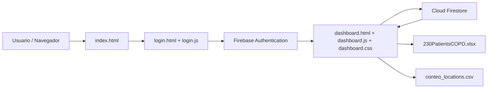
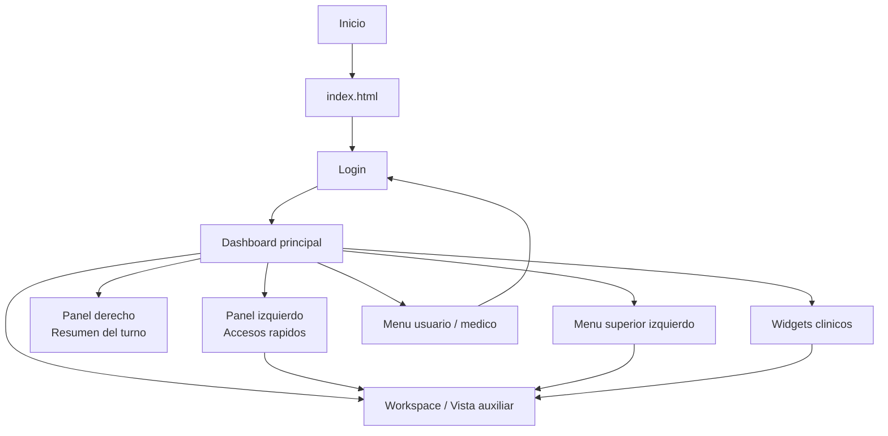

# Detalles Tecnicos de Foxcat Medical

Este documento esta orientado a informaticos y personal tecnico que necesite entender la estructura general del proyecto, sus variables mas relevantes y los puntos donde es mas comun hacer modificaciones.

## 1. Vision tecnica rapida

Foxcat Medical es una aplicacion web cliente que:

- inicia en `index.html`
- redirige al login en `healtUsurper/login.html`
- autentica con Firebase Authentication
- carga el dashboard en `healtUsurper/FirstView/dashboard.html`
- sincroniza pacientes y preferencias visuales con Firestore
- usa archivos locales de prueba para el modulo de IA clinica explicable

## 2. Variables importantes

No se listan todas las variables del proyecto. Solo las mas importantes para mantenimiento y personalizacion.

### 2.1 Variables de estructura del dashboard

Archivo principal: `healtUsurper/FirstView/dashboard.js`

#### `defaultWidgetOrder`

Define el orden base de los widgets visibles en el dashboard.

Ejemplo de uso:

- cambiar el orden inicial del tablero
- agregar una nueva clave si se crea un nuevo widget

Impacto esperado:

- modifica el orden por defecto para usuarios nuevos
- si se cambia una clave existente, tambien debe actualizarse en `widgetCatalog` y en el HTML

#### `widgetCatalog`

Mapa central de widgets. Cada clave contiene:

- `label`
- `description`
- `shortcutDescription`

Ejemplo de uso:

- renombrar widgets
- cambiar textos de ayuda
- exponer un widget nuevo en menus de seleccion y accesos rapidos

Recomendacion:

- mantener las claves estables, por ejemplo `notes`, `patients`, `labs`
- si se cambia una clave, revisar accesos rapidos, insercion de widgets y renderizado

#### `defaultQuickAccess`

Lista inicial de accesos rapidos del panel izquierdo.

Ejemplo de uso:

- agregar un atajo por defecto a `visual-settings`
- quitar accesos si se quiere un panel mas limpio para nuevos usuarios

Campos relevantes por item:

- `id`
- `type`
- `target`
- `label`

### 2.2 Estado global de la interfaz

#### `state`

Objeto principal de estado de la UI. Es una de las piezas mas importantes del sistema.

Campos recomendados para entender primero:

- `patients`: pacientes cargados desde Firestore
- `selectedPatientId`: paciente activo en el dashboard
- `layoutOrder`: orden actual de widgets
- `widgetSizes`: tamanos persistidos por widget
- `hiddenWidgetKeys`: widgets ocultos
- `quickAccessItems`: accesos rapidos activos
- `theme`: `light` o `dark`
- `uiMode`: modo actual de interaccion, actualmente centrado en `idle` y `remove-widget`
- `placementTarget`: objetivo temporal usado en el flujo de eliminacion
- `activeResizeWidgetKey`: widget actualmente habilitado para resize fino
- `resizeSession`: estado temporal del redimensionamiento por bordes

Posibles modificaciones:

- agregar nuevos modos de interfaz dentro de `uiMode`
- persistir mas preferencias visuales dentro del mismo estado
- introducir filtros activos por medico o por prioridad

Precaucion:

- si se agregan campos nuevos al estado y deben persistirse, revisar `saveUserLayout()` y `loadUserLayout()`

### 2.3 Variables de IA clinica y contexto regional

#### `regionProfiles`

Mapa de perfiles regionales simulados usados por la IA.

Contiene datos como:

- altitud
- temperatura
- humedad
- calidad del aire
- ajuste de oxigenacion
- enfoque de recomendacion

Posibles modificaciones:

- agregar nuevas ciudades
- ajustar altitudes y factores ambientales
- personalizar recomendaciones por hospital o sede

Impacto:

- cambia el texto explicativo del widget IA
- altera algunos calculos del riesgo clinico orientativo

#### `fallbackTrainingProfile`

Perfil minimo usado mientras el dataset local aun no carga o falla.

Posibles modificaciones:

- actualizar medias base
- cambiar la ciudad base
- adaptar el perfil a otro conjunto de pacientes

#### `expectedOxygen`

Variable generada dentro de `computeClinicalAssessment(patient)`.

Uso:

- estima la saturacion esperada del paciente segun contexto base y ajuste regional

Posibles modificaciones:

- redondear mas agresivamente
- usar una formula distinta
- introducir ajuste por edad, IMC o gravedad

### 2.4 Variables de autenticacion y datos

Archivo relevante: `healtUsurper/firebase/firebase-config.js`

#### `firebaseConfig`

Configuracion de Firebase.

Campos conocidos:

- `authDomain`
- `storageBucket`
- otros identificadores del proyecto Firebase

Posibles modificaciones:

- migrar a otro proyecto Firebase
- separar entorno de desarrollo y produccion

Precaucion:

- si cambia el proyecto, revisar reglas, Authentication y colecciones de Firestore

#### `auth`

Instancia de Firebase Authentication.

Uso principal:

- login
- logout
- persistencia de sesion
- deteccion de usuario autenticado

#### `db`

Instancia de Firestore.

Uso principal:

- lectura y escritura de `patients`
- lectura y escritura de `userLayouts`

## 3. Puntos frecuentes de personalizacion

### 3.1 Cambiar el orden o disponibilidad de widgets

Revisar:

- `defaultWidgetOrder`
- `widgetCatalog`
- `hiddenWidgetKeys`
- `getDefaultInsertBeforeKey(widgetKey)`

Nota:

- el agregado de widgets ahora es instantaneo
- la posicion de insercion se calcula con el orden base del tablero
- despues del agregado se aplica un resaltado temporal para ubicar el widget nuevo

### 3.2 Cambiar accesos rapidos iniciales

Revisar:

- `defaultQuickAccess`
- `renderQuickAccessList()`
- `renderQuickAccessPicker()`

### 3.3 Cambiar reglas de evaluacion IA

Revisar:

- `computeClinicalAssessment(patient)`
- `regionProfiles`
- `fallbackTrainingProfile`
- archivos de prueba en `healtUsurper/test/`

### 3.4 Cambiar persistencia del layout por medico

Revisar:

- `loadUserLayout(userId)`
- `saveUserLayout()`
- coleccion `userLayouts`

### 3.5 Cambiar comportamiento de resize y cursores

Revisar:

- `getResizeDirectionForPointer(widget, clientX, clientY)`
- `beginWidgetResize(widget, direction, event)`
- `handleWidgetResizeMove(event)`
- reglas CSS `data-resize-cursor`

Posibles modificaciones:

- ampliar o reducir el area sensible de bordes cambiando `edge`
- personalizar los cursores por tema
- desactivar resize diagonal o vertical si el proyecto lo requiere

## 4. Diagrama de flujo

```mermaid
flowchart TD
    A[index.html] --> B[healtUsurper/login.html]
    B --> C{Usuario autenticado?}
    C -- No --> D[Mostrar formulario de login/registro]
    D --> B
    C -- Si --> E[dashboard.html]
    E --> F[bootDashboard()]
    F --> G[setPersistence + onAuthStateChanged]
    G --> H[loadUserLayout(user.uid)]
    H --> I[onSnapshot patients]
    I --> J[renderDashboard()]
    J --> K[Interacciones del usuario]
    K --> L[Agregar/editar/eliminar pacientes]
    K --> M[Editar layout y widgets]
    K --> N[Usar accesos rapidos]
    K --> O[Ejecutar IA clinica orientativa]
    L --> I
    M --> P[saveUserLayout()]
    N --> J
    O --> J
```

## 5. Diagrama de red aproximado

Este diagrama es una aproximacion basada solo en lo visible en el codigo actual.



## 6. Diagrama / mapa del sitio web



## 7. Estructura tecnica resumida de archivos

- `index.html`: pantalla de arranque y redireccion al login
- `healtUsurper/login.html`: interfaz de acceso
- `healtUsurper/login.js`: login, registro y redireccion por sesion
- `healtUsurper/FirstView/dashboard.html`: estructura del dashboard
- `healtUsurper/FirstView/dashboard.css`: estilos, modo oscuro, overlays y layout
- `healtUsurper/FirstView/dashboard.js`: logica principal de UI, widgets, IA y persistencia
- `healtUsurper/firebase/firebase-config.js`: inicializacion de Firebase
- `healtUsurper/firebase/firestore.rules`: reglas de Firestore
- `healtUsurper/test/230PatientsCOPD.xlsx`: dataset local de apoyo
- `healtUsurper/test/conteo_locations.csv`: distribucion local por ubicacion

## 8. Recomendaciones para futuras modificaciones

- Si se agrega un widget nuevo, actualizar `dashboard.html`, `widgetCatalog`, `defaultWidgetOrder` y la logica de render.
- Si se cambia el comportamiento de insercion de widgets, revisar `addWidgetInstantly()` y `getDefaultInsertBeforeKey()`.
- Si se cambia la experiencia de resize, revisar tanto JS como los cursores SVG embebidos en CSS.
- Si se cambia la IA, mantener separada la parte explicativa de la parte de calculo para que siga siendo auditable.
- Si se agregan nuevas preferencias de usuario, definir si van a `localStorage`, `userLayouts` o ambas.
- Si el sistema crece, conviene separar `dashboard.js` en modulos: autenticacion, layout, IA, pacientes, accesos rapidos y render.

## 9. Limitaciones conocidas

- La IA es orientativa y local al navegador; no es un servicio clinico remoto real.
- El diagrama de red no incluye backend propio porque en el codigo actual no aparece uno distinto de Firebase.
- El proyecto depende de servir archivos por `localhost` o web server; `file://` no es suficiente para `fetch`.
