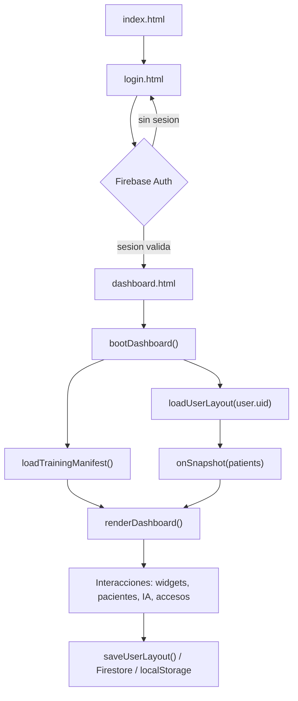
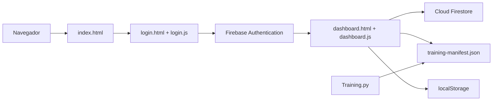

# Detalles Tecnicos de Foxcat Medical

Este documento describe el estado actual del codigo. La linea de tiempo al final conserva contexto historico, pero las variables, flujos y puntos de modificacion corresponden al dashboard vigente.

## 1. Arquitectura rapida

Foxcat Medical es una aplicacion web cliente:

- `index.html` precarga recursos y envia al login.
- `healtUsurper/login.html` y `login.js` manejan autenticacion.
- `healtUsurper/FirstView/dashboard.html` contiene la estructura del dashboard.
- `healtUsurper/FirstView/dashboard.css` contiene estilos, tema oscuro, overlays y responsive.
- `healtUsurper/FirstView/dashboard.js` concentra estado, render, widgets, pacientes, layout e IA.
- Firebase Authentication gestiona sesion.
- Cloud Firestore guarda pacientes y preferencias de usuario.
- `healtUsurper/ai/model-loader.js` carga `training-manifest.json`.
- `healtUsurper/test/Training.py` genera el manifiesto IA offline.

## 1.1 Licencia del proyecto

El archivo `LICENSE` contiene una licencia personalizada llamada `Foxcat Medical Public Research and Restricted Commercial License`.

Resumen operativo:

- permite uso libre no comercial para investigacion, aprendizaje, revision, modificacion, edicion, auditoria y prototipado;
- restringe uso comercial, empresarial, institucional o productivo sin autorizacion escrita previa del desarrollador o titular;
- asigna al usuario la responsabilidad por contenido que suba, importe, almacene o muestre mediante el sistema;
- incluye una clausula de indemnidad para desarrolladores, creadores, operadores, servidores y bases de datos frente a reclamos derivados de contenido de usuario;
- declara que parte del codigo, arreglos o documentacion pudo ser asistida con IA mediante el metodo `HybridVibeCoding`;
- no es una licencia estandar OSI, GNU, Creative Commons ni SPDX.

Antes de publicar el proyecto o usarlo con clientes, entidades o despliegues productivos, conviene revisar esta licencia con un abogado.

## 2. Estado global de UI

Archivo: `healtUsurper/FirstView/dashboard.js`

### `state`

Campos principales:

- `patients`: pacientes recibidos desde Firestore.
- `selectedPatientId`: paciente activo.
- `layoutOrder`: orden vigente de widgets.
- `draftLayoutOrder`: orden temporal durante edicion.
- `persistedLayoutOrder`: ultimo orden guardado antes de editar.
- `widgetSizes`: tamanos guardados por widget.
- `draftWidgetSizes`: tamanos temporales durante edicion.
- `persistedWidgetSizes`: ultimo mapa de tamanos guardado antes de editar.
- `layoutEditMode`: indica si esta activo `Editar posiciones`.
- `draggedWidgetKey`: widget que se esta arrastrando.
- `activeResizeWidgetKey`: widget seleccionado para resize por bordes.
- `hiddenWidgetKeys`: widgets ocultos.
- `quickAccessItems`: accesos rapidos del panel izquierdo.
- `theme`: `light` o `dark`.
- `uiMode`: modo de interaccion; actualmente `idle` y `remove-widget`.
- `placementTarget`: destino temporal para mover o eliminar widgets.
- `placementCommitPending`: evita doble confirmacion de eliminacion.
- `resizeSession`: estado temporal del resize de widgets.
- `aiDebugOpen`: visibilidad del panel tecnico IA.
- `aiDebugMinimized`: estado minimizado del panel IA.
- `aiDebugPosition`: posicion del panel IA.
- `aiDebugDrag`: sesion de arrastre del panel IA.
- `aiDebugSize`: tamano del panel IA.
- `aiDebugResizeSession`: sesion de resize del panel IA.
- `doctorProfile`: nombre y foto persistidos por medico.
- `questionnaires`: cuestionarios locales.
- `selectedQuestionnaireId`: cuestionario local activo.

Cuando se agregue un campo persistente, revisar `loadUserLayout()` y `saveUserLayout()`.

## 3. Widgets y layout

### `defaultWidgetOrder`

Define el orden base y contiene:

- `overview`
- `medic-ai`
- `consult-analysis`
- `alerts`
- `agenda`
- `status`
- `form`
- `questionnaires`
- `patients`
- `labs`
- `critical`
- `location`
- `notes`

### `widgetCatalog`

Mapa de metadatos de widgets. Cada clave contiene:

- `label`
- `description`
- `shortcutDescription`

Si se crea un widget nuevo, actualizar:

- `dashboard.html`
- `defaultWidgetOrder`
- `widgetCatalog`
- render correspondiente en `renderDashboard()`
- estilos en `dashboard.css` si requiere estructura especial

### Funciones de orden y visibilidad

- `normalizeWidgetOrder(order)`: elimina claves desconocidas y agrega faltantes al final.
- `applyWidgetOrder(order)`: aplica `style.order` a cada widget.
- `applyWidgetVisibility()`: usa `hiddenWidgetKeys` para mostrar u ocultar.
- `getOrderedVisibleWidgetKeys(order, excludeKey)`: claves visibles ordenadas.
- `getOrderedVisibleWidgetElements(order, excludeKey)`: elementos visibles ordenados.
- `moveWidgetBefore(list, draggedKey, insertBeforeKey)`: calcula el nuevo orden.

### Edicion de posiciones

El flujo actual evita mover el DOM constantemente durante el arrastre:

1. `dragstart` define `state.draggedWidgetKey`.
2. `dragover` calcula el destino con `getInsertionTargetFromPoint()`.
3. `updatePlacementVisuals()` muestra la previsualizacion.
4. `drop` llama `applyDraftLayoutFromPointer()` y aplica el orden temporal.
5. El boton verde persiste con `saveUserLayout()`.
6. El boton rojo restaura `persistedLayoutOrder` y `persistedWidgetSizes`.

El auto-scroll del arrastre esta en:

- `WIDGET_DRAG_SCROLL_EDGE_PX`
- `WIDGET_DRAG_SCROLL_MAX_STEP`
- `autoScrollViewportForWidgetDrag(clientY)`
- listener global `document.addEventListener("dragover", ...)`

### Eliminacion de widgets

El flujo actual:

- `startRemoveWidgetFlow()` activa `uiMode = "remove-widget"`.
- `getDeleteTargetFromPoint()` identifica el widget bajo el cursor con `elementsFromPoint`.
- `updatePlacementVisuals(..., "remove")` marca la zona objetivo.
- clic izquierdo confirma con `finalizeWidgetRemoval()`.
- clic derecho cancela con `cancelWidgetInteraction()`.

`finalizeWidgetRemoval()` agrega la clave a `hiddenWidgetKeys`, elimina accesos rapidos que apuntaban a ese widget, renderiza y guarda el layout.

### Resize de widgets

Funciones relevantes:

- `getResizeDirectionForPointer(widget, clientX, clientY)`
- `getResizeCursorToken(direction)`
- `beginWidgetResize(widget, direction, event)`
- `handleWidgetResizeMove(event)`
- `stopWidgetResize()`
- `clampWidgetSize(widget, size)`
- `applyWidgetSizes(sizes)`
- `syncResponsiveWidgetShapes()`

El resize se activa con doble clic sobre un widget mientras `layoutEditMode` esta activo.

## 4. Persistencia

### Firestore: `userLayouts`

`saveUserLayout()` guarda:

- `widgetOrder`
- `widgetSizes`
- `hiddenWidgetKeys`
- `quickAccessItems`
- `theme`
- `updatedAt`

`loadUserLayout(userId)` tambien lee:

- `doctorProfile.displayName`
- `doctorProfile.photoUrl`

La escritura usa `setDoc(..., { merge: true })`, por eso campos como `doctorProfile` pueden conservarse aunque `saveUserLayout()` no los reescriba en cada guardado.

### Firestore: `patients`

Campos normalizados por `sanitizePatientPayload(raw)`:

- `name`
- `documentId`
- `age`
- `condition`
- `status`
- `photoUrl`
- `bloodPressureSystolic`
- `bloodPressureDiastolic`
- `pulse`
- `glucose`
- `hemoglobin`
- `creatinine`
- `oxygenSaturation`
- `respiratoryRate`
- `bmi`
- `packHistory`
- `copdGold`
- `smokingStatus`
- `heartFailureHistory`
- `ecg`
- `bnp`
- `coronaryHistory`
- `arrhythmias`
- `locationCity`
- `locationElevationM`
- `locationRiskLevel`
- `ward`
- `room`
- `appointmentTime`
- `monitoringTime`
- `labTime`
- `notes`

El CRUD usa:

- `openCreatePatientModal()`
- `openEditPatientModal(patient)`
- `openLookupModal(action)`
- `renderPatientHistory(patient)`
- `openDeleteConfirmation(patient)`
- `openAppointmentModal(patient)`
- `savePatient(event)`

La eliminacion de pacientes requiere escribir `ELIMINAR`.

### LocalStorage: cuestionarios

Clave:

- `foxcat-patient-questionnaires`

Funciones:

- `loadQuestionnaires()`
- `saveQuestionnaires()`
- `renderQuestionnaires()`
- `getSelectedQuestionnaire()`

Los cuestionarios no se sincronizan con Firestore en el codigo actual.

## 5. Accesos rapidos

### `defaultQuickAccess`

Define accesos iniciales del panel izquierdo.

Campos por item:

- `id`
- `type`: `widget` o `action`
- `target`
- `label`

Funciones:

- `normalizeQuickAccessItems(items)`
- `renderQuickAccessList()`
- `renderQuickAccessPicker()`
- `showQuickAccessPicker()`
- `showQuickAccessRemovalPicker()`
- `activateQuickAccess(item)`

Los accesos de tipo `widget` hacen scroll al widget si esta visible. Si el widget esta oculto, el dashboard muestra un estado de error.

## 6. IA clinica

### Carga del manifiesto

Archivo: `healtUsurper/ai/model-loader.js`

Funciones:

- `fetchTrainingManifest()`: lee `training-manifest.json` con `cache: "no-store"`.
- `loadTrainingManifest({ forceRefresh })`: usa cache salvo que se pida refresco.
- `cacheTrainingManifest(manifest)`: guarda en `sessionStorage` y `localStorage`.
- `summarizeActiveModel(manifest)`: texto corto del modelo activo.

Claves de cache:

- `foxcat-ai-training-manifest`
- `foxcat-ai-training-manifest-session`

### Entrenamiento offline

Archivo: `healtUsurper/test/Training.py`

Responsabilidades:

- leer dataset local;
- entrenar candidatos;
- seleccionar modelo activo;
- exportar `training-manifest.json`;
- exportar artefactos de modelo cuando aplica.

El navegador no entrena Python ni ejecuta `.joblib`.

### Evaluacion por paciente

Funciones principales en `dashboard.js`:

- `computeClinicalAssessment(patient)`
- `buildClinicalForecast(patient, assessment, region)`
- `buildAiMethodRouting(patient, assessment, region)`
- `buildDomainRiskTimeline(assessment)`
- `buildRiskDrivers(patient, assessment)`
- `buildProtectiveFactors(patient, assessment)`
- `buildConsultationAnalysis(patient)`
- `buildAiDebugData(patient)`

`computeClinicalAssessment(patient)` produce:

- `shortRisk`
- `weekRisk`
- `longRisk`
- `outcomeRisks.respiratory`
- `outcomeRisks.cardiac`
- `outcomeRisks.dangerousSymptom`
- `dominantRiskType`
- `confidence`
- `expectedOxygen`
- `environmentalSummary`
- `summary`
- `triggers`
- `keyFindings`
- `recommendations`
- `forecast`
- `aiMethods`

Variables clinicas que mas pesan:

- estado actual;
- saturacion frente a expectativa regional;
- frecuencia respiratoria;
- pulso;
- presion arterial;
- glucosa;
- creatinina;
- hemoglobina;
- IMC;
- `COPD GOLD`;
- tabaquismo;
- falla cardiaca;
- antecedentes coronarios;
- arritmias;
- BNP;
- ECG;
- altitud y contexto regional.

### Estados de metodo IA

- `Activa`: participa directamente en la lectura o coincide con el modelo activo del manifiesto.
- `Proxy clinico`: representada por reglas explicables y contexto clinico, sin implicar inferencia dedicada en navegador.
- `Pendiente`: contemplada para la arquitectura, pero sin activacion fuerte o runtime dedicado actual.

## 7. Contexto regional

`regionProfiles` contiene:

- `label`
- `altitude`
- `careFocus`
- `accessPressure`
- `oxygenAdjustment`
- `climate`
- `temperatureC`
- `airQuality`
- `airQualityIndex`
- `humidity`
- `respiratoryStress`
- `recommendationFocus`

Ciudades actuales:

- Barcelona
- Pasto-Narino
- Cali
- Medellin
- Bogota
- Ipiales

Funciones relacionadas:

- `normalizeRegionName(locationCity)`
- `getLocationElevationMeters(locationCity)`
- `normalizeLocationRiskLevel(locationCity)`
- `getRegionProfile(locationCity)`

## 8. Panel tecnico IA

Funciones:

- `openAiDebugWindow()`
- `closeAiDebugWindow()`
- `toggleAiDebugMinimize()`
- `beginAiDebugDrag(event)`
- `handleAiDebugDrag(event)`
- `beginAiDebugResize(direction, event)`
- `handleAiDebugResize(event)`
- `clampAiDebugSize(size)`
- `applyAiDebugWindowGeometry()`
- `renderAiDebugWindow()`

El panel muestra resumen del caso, metodo activo, metricas del manifiesto, cobertura de datos, trazas, factores de riesgo, factores protectores y curvas explicables.

## 9. Importacion y exportacion

El dashboard usa `window.XLSX` cuando esta disponible.

Funciones relevantes:

- `importPatientsFromFile(event)`
- `exportSelectedPatient()`
- `exportAllPatients()`
- `downloadWorkbook(workbook, filename)`
- `sanitizePatientPayload(raw)`

Si se cambian nombres de campos importados, ajustar `getRawField(...)` dentro de `sanitizePatientPayload(raw)`.

## 10. Diagramas

### Flujo de aplicacion

```mermaid
flowchart TD
    A["index.html"] --> B["login.html"]
    B --> C{"Firebase Auth"}
    C -- "sin sesion" --> B
    C -- "sesion valida" --> D["dashboard.html"]
    D --> E["bootDashboard()"]
    E --> F["loadUserLayout(user.uid)"]
    E --> G["loadTrainingManifest()"]
    F --> H["onSnapshot(patients)"]
    G --> I["renderDashboard()"]
    H --> I
    I --> J["Interacciones: widgets, pacientes, IA, accesos"]
    J --> K["saveUserLayout() / Firestore / localStorage"]
```

### Red aproximada

```mermaid
flowchart LR
    U["Navegador"] --> I["index.html"]
    I --> L["login.html + login.js"]
    L --> A["Firebase Authentication"]
    A --> D["dashboard.html + dashboard.js"]
    D --> F["Cloud Firestore"]
    D --> M["training-manifest.json"]
    D --> LS["localStorage"]
    T["Training.py"] --> M
```

## 11. Recomendaciones de mantenimiento

- Si agregas un widget, actualiza HTML, catalogo, orden base, render y estilos.
- Si cambias el layout, prueba agregar, eliminar, mover, guardar y cancelar.
- Si cambias el drag, revisa `getInsertionTargetFromPoint()`, `updatePlacementVisuals()` y `autoScrollViewportForWidgetDrag()`.
- Si cambias campos de paciente, actualiza normalizacion, formularios, historia, exportacion e IA.
- Si cambias la IA, regenera el manifiesto con `Training.py`.
- Si cambias metricas, documenta si estan en escala `0-1`, `-1 a 1` o `0-100`.
- Si agregas persistencia de usuario, decide entre Firestore (`userLayouts`) y `localStorage`.
- Si el archivo `dashboard.js` sigue creciendo, separar por dominios: layout, pacientes, IA, cuestionarios, accesos y render.

## 12. Limitaciones actuales

- No hay backend propio distinto de Firebase.
- La IA es orientativa y no es validacion clinica formal.
- El dashboard consume un manifiesto precalculado; no reentrena automaticamente con pacientes nuevos.
- Los cuestionarios son locales al navegador.
- Algunas capas IA son explicativas o proxy, no inferencias dedicadas en runtime.
- El proyecto debe servirse por HTTP local o hosting web.

## 13. Linea de tiempo resumida

- Inicio: dashboard clinico con login Firebase y widgets basicos.
- Personalizacion: modo claro/oscuro, foto de medico, accesos rapidos y persistencia por usuario.
- Layout: orden, ocultamiento, agregar widgets, resize y confirmacion de cambios.
- IA: manifiesto offline, panel tecnico, analisis de consulta y contexto regional.
- Pacientes: CRUD, historia clinica, importacion/exportacion y cita del dia.
- Cuestionarios: links y QR guardados localmente.
- Ajuste reciente: eliminacion visual robusta, movimiento con previsualizacion estable y auto-scroll vertical durante el arrastre.
